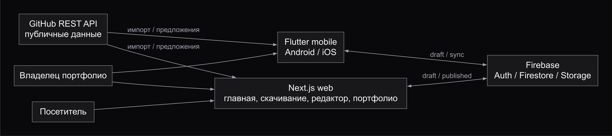


<div align="center">

# StackCard Architecture

**Текущая Flutter-основа и целевые границы mobile, web и общего backend**


</div>

---

## Содержание

- [Текущее состояние — Phase 0](#текущее-состояние--phase-0)
- [Схема системы](#схема-системы)
- [Зоны ответственности](#зоны-ответственности)
- [Целевые границы — ещё не реализованы](#целевые-границы--ещё-не-реализованы)
- [Web и общие контракты](#web-и-общие-контракты)
- [Mobile modules — при реальных сценариях](#mobile-modules--при-реальных-сценариях)
- [Source, draft и публикация](#source-draft-и-публикация)
- [Ключевые потоки](#ключевые-потоки)
- [Границы расширения](#границы-расширения)
- [Нефункциональные требования](#нефункциональные-требования)
- [Завершение Phase 0](#завершение-phase-0)

---

## Текущее состояние — Phase 0

В monorepo есть одно Flutter-приложение в `apps/mobile`. Оно перенесено из корня
без повторной генерации platform scaffolds. Entry point —
[`lib/main.dart`](../../apps/mobile/lib/main.dart): `StackCardApp` и стартовый счётчик.
[`widget_test.dart`](../../apps/mobile/test/widget_test.dart) проверяет запуск и
обновление состояния. Продуктовых моделей, маршрутов, backend и хранилищ пока нет.

Canonical sources: [`pubspec.yaml`](../../apps/mobile/pubspec.yaml),
[`pubspec.lock`](../../apps/mobile/pubspec.lock),
[`analysis_options.yaml`](../../apps/mobile/analysis_options.yaml).
SDK constraint и разрешённые версии берём из них, native settings — из platform
directories приложения. `.metadata` и generated-файлы вручную не меняем.

Mobile scope — Android и iOS; их native scaffolds сохранены, Android — первый
release target. Desktop и Flutter web targets в `apps/mobile` отсутствуют.
Сайт с публичными страницами и защищённым редактором планируется отдельно
в Next.js-приложении `apps/web` на Phase 13.

В [apps/web](../../apps/web/README.md) сейчас только README с назначением каталога;
web-приложение, его зависимости и команды запуска ещё не созданы.

Logo originals в `assets/branding` пока не подключены к Flutter. Цветовая система
описана в [design guide](../design/design-system.md). Seed-тема счётчика временная;
UI foundation начнётся на Phase 1.

---

## Схема системы

**Целевая архитектура, ещё не реализованная целиком.** Существующий Flutter
scaffold — основа mobile. Остальные узлы и связи вводятся на своих фазах.
Схема описывает ответственность компонентов; точная Firestore schema и
механизм публикации определяются перед интеграцией backend.

### Общий обзор



[Mermaid-исходник обзора](../diagrams/architecture-overview.mmd).

### Редактирование и публикация



[Mermaid-исходник схемы](../diagrams/architecture-system.mmd).

Публичная страница не читает private draft. GitHub поставляет предложения для
редактора; только отдельное действие владельца обновляет published snapshot.
Логический узел публикации не означает заранее выбранную Firebase Function
или созданный endpoint: доверенная проверка и атомарность будут спроектированы
на Phase 8.

---

## Зоны ответственности

### apps/mobile

Исполняемый Flutter-клиент для Android и iOS. Сейчас владеет bootstrap и его
widget test; UI, offline draft/cache и native integrations вводятся по фазам.
Mobile не владеет реализацией сайта или доверенными серверными операциями.

### apps/web

Отдельный будущий Next.js-клиент: marketing pages, защищённый редактор и
public portfolio. Пока содержит только README. Общие data contracts связывают
клиенты без импорта Flutter/Dart runtime в React/TypeScript.

### assets/branding

Оригинальные SVG и brand kit. Runtime integration и launcher icons создаются
на своих фазах; сохранённый оригинал не заменяется промежуточным экспортом.

### docs и docs/AI

Product spec владеет сценариями и roadmap, architecture — границами системы,
design guide — визуальными правилами, ADR — существенными решениями.
Общие AI-инструкции, router и scope rules хранятся в [docs/AI](../AI/README.md).
Root/nested AGENTS — точки входа к этому контексту, без копий общих правил.
Runtime configs остаются рядом с кодом и сохраняют владение своими значениями.

---

## Целевые границы — ещё не реализованы

<div align="center">

| **Часть** | **Ответственность и срок введения** |
|:---|:---|
| `apps/mobile` | Android/iOS-редактор, offline draft и sync; функции по roadmap |
| `apps/web` | Главная, download, кабинет и public portfolio; Phase 13–14 |
| `firebase` — каталог ещё не создан | Auth, Firestore, Storage, Rules и FCM; Phase 7–14 |
| `.github/workflows` — ещё не создан | Проверки и APK artifact; Phase 18 |

</div>

Это один продукт, поэтому один monorepo. Общий Firebase project будет обслуживать
mobile и web; отдельный NestJS/PostgreSQL backend в v1 не нужен. Mobile не импортирует
web-код. Публичные страницы читают только опубликованное представление; редактор
в защищённом web-кабинете работает с private draft своего владельца.
Firebase Functions добавляются только при реальной необходимости доверенных
операций. Будущая CI проверит format/analyze/tests/coverage и сохранит APK artifact.

---

## Web и общие контракты

Next.js — целевой стек сайта, пока без созданного приложения и установленных
web-зависимостей. Один Firebase backend и один аккаунт связывают mobile и web.
Клиенты разделяют правила модели, ownership, validation, sync и явной публикации;
Dart и TypeScript реализуют их независимо в своих стеках. Общие data contracts
не означают общий runtime-код или перенос Flutter widgets в React.

Планируемые группы маршрутов, **не существующая конфигурация routing**:

<div align="center">

| **Группа** | **Ответственность и доступ** |
|:---|:---|
| `/`, `/download` | Публичная информация о проекте и мобильных релизах. |
| `/sign-in`, `/sign-up` | Authentication. |
| `/app` и вложенные страницы | Защищённые профиль/проекты/блоки, preview, publish/unpublish, Inbox и настройки своего аккаунта. |
| `/u/[username]` | Только published portfolio, SEO/metadata/OpenGraph; Contact me на Phase 14. |

</div>

Защита маршрута помогает UX, но не заменяет ownership checks в Firebase Rules
и на доверенной стороне. Владелец читает/изменяет свой draft из обоих клиентов;
анонимный посетитель не получает account data, черновики или Inbox.

Mobile сохраняет offline draft и cache. Web v1 планируется online-first с явными
состояниями несохранённых изменений, сохранения, sync error и retry. Перед Phase 8
нужно выбрать strategy конфликтов между устройствами и клиентами, согласовать
data contracts и private/public границу. Перед Phase 13 проверить совместимость
web-редактора с этой моделью; не создавать вторую независимую модель портфолио.

Phase 13 развивается по шагам: **13a** — public shell, главная и скачивание mobile;
**13b** — auth/защищённый кабинет и редактор общего draft; **13c** — published
портфолио, preview и publish/unpublish. Детали — в [roadmap](../product/product-spec.md#roadmap).
Это план после мобильных фундаментальных фаз; реализация в Phase 0 не начинается.

---

## Mobile modules — при реальных сценариях

На Phase 3 первые features получат `presentation/domain/data`, Repository Pattern
и Riverpod dependency injection. Пример целевого размещения, **не текущий tree**:

```text
lib/
├── main.dart
├── app/                     # composition и app shell
├── core/                    # только используемые общие механизмы
│   ├── routing/
│   ├── theme/
│   ├── network/
│   ├── storage/
│   ├── errors/
│   └── widgets/
└── features/
    └── <feature>/
        ├── presentation/    # widgets, controllers, UI states
        ├── domain/          # модели/правила, contracts repositories
        └── data/            # DTO, mapping, реализации sources/repositories
```

Auth и profile/projects — первые модули; github, portfolio, home, inbox, location
и settings добавляются вместе с соответствующими функциями. Пустые директории,
универсальный framework и интерфейсы «на будущее» не нужны.

Зависимости: presentation → domain, data → domain. `app`/providers связывают
реализации. Domain не зависит от widgets, Firebase, Dio или Hive. Widget обращается
к controller/notifier, тот — к repository или UseCase с содержательной бизнес-логикой.
DataSource выделяется при реальной необходимости источника данных/тестирования.

Provider ограничивается учебными theme/locale; основное состояние продукта — Riverpod.
При необходимости учебный пример проходит `setState → InheritedWidget → Provider`,
не оставляя несколько реализаций одного сценария в production-коде. GoRouter —
routing/guards, Dio — GitHub. Serialization вводится вместе с реальными моделями.

---

## Source, draft и публикация

1. **GitHub source:** публичный профиль и repository metadata для импорта/сравнения.
   В v1 не нужен private repository access.
2. **Curated draft:** пользовательские описания, выбранные проекты, screenshots,
   технологии, links, featured/visibility/order и настройки блоков.
3. **Published representation:** явно опубликованные данные публичной страницы.
   Изменения draft и GitHub sync не становятся публичными сами по себе.

GitHub не является абсолютным source of truth. Будущий Project связан с repository
через стабильный ID и хранит источник (`manual`/`github`), время/состояние sync.
Пользовательские overrides отличаются от импортированных полей. Новые/изменённые
repositories дают предложения, которые пользователь просматривает.

Mobile offline: локальный cache и редактируемый draft, затем Firestore synchronization;
состояния `pending`, `synced`, `error`. Preferences — простые настройки, Hive
предпочтителен по учебному заданию для draft/cache. Альтернатива требует причины и ADR.
Conflict strategy ещё не выбрана; простая last-write-wins допустима после фиксации
последствий, включая несколько устройств и правки из mobile/web. Изменение draft
в одном клиенте должно стать доступным другому после успешной синхронизации.

Firestore schema из ТЗ — направление, не контракт. Перед Phase 8 спроектировать
private account/draft и public snapshot, уникальность username, атомарность
publish/unpublish и rules. Один `published`-флаг при смешивании private/public полей
не решает границу доступа; её нужно проверять явно.

Suggestions сначала deterministic, тестируются независимо от UI. Числовой
ProjectScore необязательно показывать; UI объясняет полезное действие.

---

## Ключевые потоки

### Запуск текущего scaffold

1. Flutter вызывает `main` в `apps/mobile/lib/main.dart`.
2. `StackCardApp` создаёт `MaterialApp` и стартовый `BootstrapPage`.
3. Нажатие на кнопку обновляет локальный счётчик через `setState`.
4. Widget test проверяет название приложения и изменение счётчика.

Этот поток не обращается к сети, Firebase или хранилищу.

### Импорт, редактура и публикация — целевой поток

1. GitHub integration получает публичные metadata и предлагает проекты для импорта.
2. Пользователь выбирает данные и дополняет curated draft в mobile или web.
3. Mobile сохраняет локальную правку и синхронизирует её через общий backend;
   web v1 сохраняет удалённо с явным статусом действия.
4. Preview показывает редактируемый результат владельцу.
5. Явное publish обновляет published representation; публичная страница читает её.

Detection изменений GitHub и синхронизация draft не выполняют шаг публикации.
Контактное обращение и notifications подключаются отдельным сценарием Phase 14.

---

## Границы расширения

<div align="center">

| **Вопрос** | **Правило размещения или изменения** |
|:---|:---|
| Где добавить мобильный сценарий? | В используемую feature внутри `apps/mobile/lib`, начиная с реального владельца |
| Где добавить страницу сайта? | В `apps/web` после создания Next.js-приложения на подтверждённой фазе |
| Когда выделять общий механизм? | Когда есть реальные потребители и одинаковая ответственность |
| Как менять data contract? | Согласовать mobile/web, private/public границы и затронутые проверки |
| Где хранить AI-правило? | В `docs/AI/AGENTS.md` или relevant scope, обновив router и adapters |
| Где хранить runtime config? | В canonical source соответствующего приложения или инструмента |
| Что документировать вместе с изменением? | Затронутый contract у его владельца, links и существенное решение в ADR |

</div>

Общая модель не требует общей runtime-библиотеки между Dart и TypeScript.
Package, UseCase или DataSource выделяется под существующий сценарий,
а не ради заранее заполненного дерева каталогов.

---

## Нефункциональные требования

Требования ниже целевые; конкретные механизмы и проверки вводятся вместе
с соответствующими интеграциями, без заявления об уже готовом backend.

<div align="center">

| **Требование** | **Подход** |
|:---|:---|
| Контроль публикации | Отделить source, draft и published representation; публиковать явно |
| Приватность | Проверять ownership на доверенной стороне и границы public snapshot |
| Работа при сбоях | Mobile cache/draft; явные sync states, error и retry в обоих редакторах |
| Поддерживаемость | Одному контракту — один владелец; features добавляются по необходимости |
| Воспроизводимость | Canonical manifests/lockfile и проверки по затронутому поведению |
| Доступность | Согласованные UI states и проверки контраста из design guide |

</div>

### Errors, privacy и интеграции — будущие требования

- Widget получает Loading/Success/Empty/Error; ошибки timeout/network/auth/parsing/
  validation/cache преобразуются на границах, без разбросанного `try/catch` в UI.
- GitHub import поддержит pagination, retry, pull-to-refresh и cache; это не GitHub client.
- Private writes ограничены owner; посторонние читают только опубликованные данные.
  Firestore/Storage Rules тестируются при интеграции. Secrets и signing data не в Git.
- Location публикуется как город/страна, без точных GPS; denied/permanently denied/
  service disabled обрабатываются отдельно.
- Media проходит MIME/size validation, compression и cleanup по спроектированным
  правилам; camera/gallery включаются по реальному сценарию.
- Web использует подходящий browser UX для файлов, location и sharing. Camera,
  maps и permissions проверяются по каждой платформе; одинаковая data model
  не обещает полного равенства нативных возможностей.
- Contact form требует validation и spam/rate-limit strategy; FCM отправляется на
  доверенной стороне, server credentials не помещаются в клиент.
- Native sharing Android: MethodChannel → Kotlin → `Intent.ACTION_SEND`.
  Developer Card и QR — Phase 15.

---

## Завершение Phase 0

Основа Phase 0 включает структуру, документы, ignore rules и logo originals.
Для её проверки зависимости должны разрешаться, format/analyze/widget test —
проходить, а scaffold — запускаться на доступном mobile target.
Ограничения окружения и реально выполненные проверки фиксируются по факту.
Первый commit/remote — отдельно по
запросу; они не запускают Phase 1 автоматически. Полный [roadmap](../product/product-spec.md)
и [решения](../decisions/README.md) дополняют этот guide.
