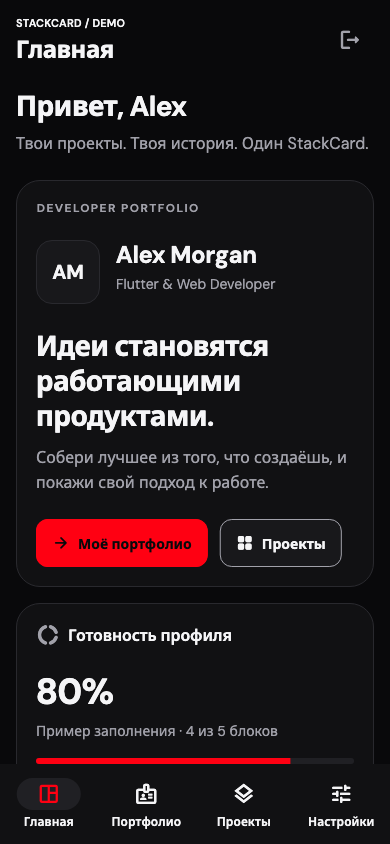
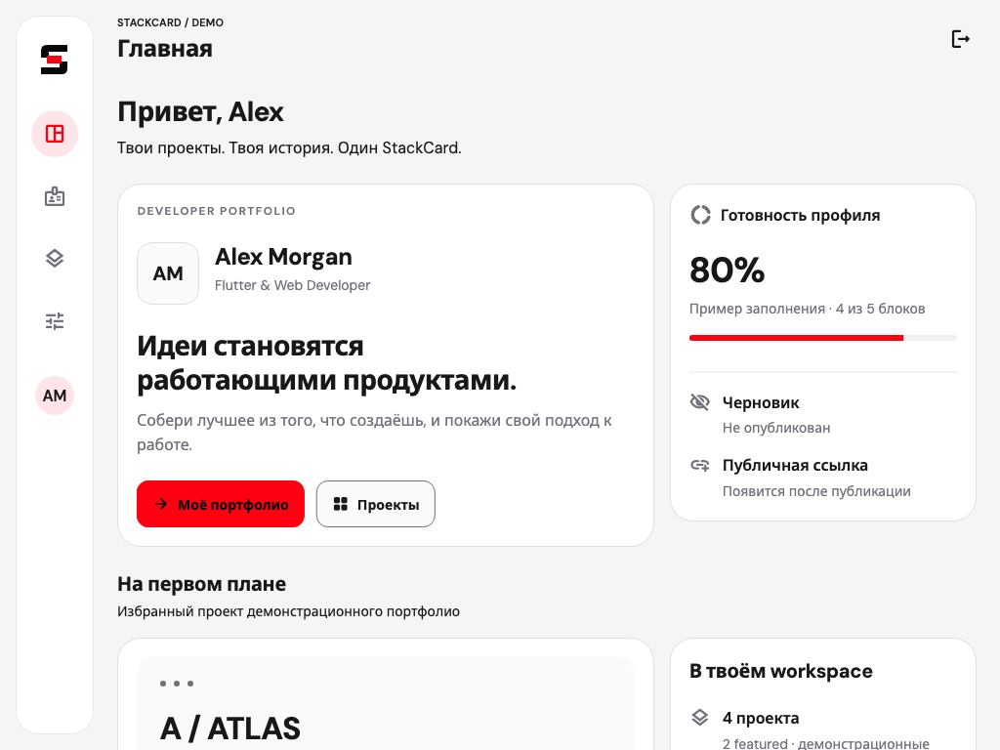

# StackCard Design

**Общий визуальный язык мобильного приложения и сайта: Obsidian + Signal Red**

---

## Содержание

- [Статус](#статус)
- [Визуальное направление](#визуальное-направление)
- [Палитра](#палитра)
- [Поверхности, radius и spacing](#поверхности-radius-и-spacing)
- [Типографика](#типографика)
- [Эскизы экранов mobile](#эскизы-экранов-mobile)
- [Состояния и доступность](#состояния-и-доступность)
- [Логотипы Link](#логотипы-link)
- [Web: главная, скачивание и редактор](#web-главная-скачивание-и-редактор)
- [Движение и reference](#движение-и-reference)

---

## Статус

**UI foundation Phase 1 реализована в mobile:** Material 3 light/dark,
типографика, tokens, общие widgets и пять экранов с демонстрационными данными.
Основная тема — dark; Settings переключает dark/light/system до закрытия
приложения. С Phase 2 выбранный ThemeMode принадлежит
[AppearanceController](../../apps/mobile/lib/core/state/appearance_controller.dart)
и распространяется через Provider; палитра и Material 3 остаются в theme.
Проверки и приёмка фазы фиксируются в
[product spec](../product/product-spec.md#phase-1--ui-foundation).

Палитра находится в
[StackCardColors](../../apps/mobile/lib/core/theme/stackcard_colors.dart),
Material 3 и типографика — в
[StackCardTheme](../../apps/mobile/lib/core/theme/stackcard_theme.dart),
spacing/radius — в
[tokens](../../apps/mobile/lib/core/theme/stackcard_tokens.dart).
Полноценный сайт с web-редактором планируется на Phase 13;
в [apps/web](../../apps/web/README.md) сейчас только README.

---

## Визуальное направление

**Obsidian + Signal Red**: нейтральные поверхности, ясная иерархия, спокойные
карточки и редкие красные акценты. Контент developer-портфолио должен быть
заметнее декоративных эффектов.

В тёмной теме ориентир распределения площади экрана:

- 80–85% — нейтральные тёмные поверхности;
- 10–15% — текст и серые элементы;
- до 5% — красный акцент.

Это визуальный ориентир, а не точная квота для каждого widget. В светлой теме
сохраняется та же сдержанность красного на светлых нейтральных поверхностях.

---

## Палитра

### Dark

| **Роль** | **HEX** | **Применение** |
|:---|:---|:---|
| `background` | `#09090B` | Фон страницы |
| `surface` | `#111113` | Основные карточки и панели |
| `surfaceElevated` | `#18181B` | Вложенные поверхности, повышенный уровень |
| `surfaceHover` | `#202024` | Наведение на нейтральную поверхность |
| `border` | `#29292E` | Разделение нейтральных поверхностей |
| `borderSubtle` | `#1F1F23` | Слабые декоративные разделители |
| `textPrimary` | `#F5F5F7` | Заголовки и основной текст |
| `textSecondary` | `#A1A1AA` | Вторичный текст |
| `textMuted` | `#71717A` | Приглушённые элементы с проверкой контраста |
| `accent` | `#FF0012` | Signal Red, основной акцент |
| `accentHover` | `#E60010` | Направление состояния hover для акцента |
| `accentSoft` | `#351014` | Небольшая акцентная подложка |
| `success` | `#22C55E` | Успешное действие или состояние |
| `warning` | `#F59E0B` | Предупреждение |
| `error` | `#EF4444` | Ошибка |

### Light

| **Роль** | **HEX** | **Применение** |
|:---|:---|:---|
| `background` | `#F5F5F6` | Фон страницы |
| `surface` | `#FFFFFF` | Основные карточки и панели |
| `surfaceElevated` | `#FAFAFA` | Повышенный уровень поверхности |
| `surfaceHover` | `#EFEFF1` | Hover и нейтральный selected state |
| `border` | `#DEDEE3` | Разделение нейтральных поверхностей |
| `borderSubtle` | `#E8E8EC` | Слабые декоративные разделители |
| `textPrimary` | `#18181B` | Заголовки и основной текст |
| `textSecondary` | `#71717A` | Вторичный текст с проверкой контраста |
| `textMuted` | `#A1A1AA` | Приглушённые элементы с проверкой контраста |
| `accent` | `#FF0012` | Signal Red, основной акцент |
| `accentHover` | `#E60010` | Направление состояния hover для акцента |
| `accentSoft` | `#FFE5E7` | Небольшая акцентная подложка |
| `success` | `#16A34A` | Успешное действие или состояние |
| `warning` | `#D97706` | Предупреждение |
| `error` | `#DC2626` | Ошибка |

Обе темы содержат все 15 утверждённых ролей. Screens и общие widgets получают
их через `context.colors`; отдельные экраны не вводят случайные HEX.

### Правила Signal Red

Красный подходит для одного основного CTA в контексте, активной навигации,
selected states, progress indicators, notification dots, небольших icons,
логотипа и focus state. Активную навигацию обозначать локальным индикатором,
иконкой или акцентом, сохраняя нейтральный фон navigation bar.

Не использовать красный для больших фоновых секций, большинства карточек,
длинных текстов, каждой кнопки и всей панели навигации. Вторичные действия
должны оставаться нейтральными. Цвет бренда не заменяет понятный текст об
ошибке или опасном действии.

---

## Поверхности, radius и spacing

Основа карточки в dark: страница `background` → карточка `surface` → вложенная
область `surfaceElevated`, с `border` по необходимости. В light использовать
`surface`, `surfaceElevated` и `surfaceHover`. Иерархию строить поверхностями, отступами и
типографикой; shadows применять умеренно.

| **Radius** | **Значение** |
|:---|:---|
| `small` | 8 |
| `medium` | 12 |
| `large` | 16 |
| `xlarge` | 24 |

Шкала spacing: **4, 8, 12, 16, 20, 24, 32, 48**. Базовый горизонтальный padding
на mobile — **16**, на tablet — **24**. В Flutter эти значения трактуются как
логические пиксели; для будущего web — как CSS px. App shell при ширине от
**700** использует боковую панель, на меньшей ширине — нижнюю навигацию.
Карточки переходят в две колонки при достаточной доступной ширине и обычном
масштабе текста; крупный системный текст возвращает последовательное чтение.
Breakpoints web определяются на Phase 13.

Pills подходят для навыков и коротких статусов. Bento-композиции допустимы,
если помогают группировать информацию; мобильный экран должен сохранять
понятный порядок чтения. Карточка не должна становиться сложным editor canvas.

---

## Типографика

[Brand kit](../../assets/branding/stackcard-link-brand-kit.json) задаёт **DM Sans**.
Mobile поставляет локальные variable fonts
[DM Sans](../../apps/mobile/assets/fonts/DM_Sans.ttf) и
[Noto Sans](../../apps/mobile/assets/fonts/Noto_Sans.ttf) как fallback для символов,
отсутствующих в основном шрифте. Они зарегистрированы в
[pubspec](../../apps/mobile/pubspec.yaml); рядом сохранены лицензии SIL OFL 1.1:
[DM Sans](../../apps/mobile/assets/fonts/DM_Sans_OFL.txt) и
[Noto Sans](../../apps/mobile/assets/fonts/Noto_Sans_OFL.txt).

Согласованная шкала Material 3 `TextTheme` задаёт headline **24–32**, title
**14–20**, body **12–16** и label **11–14**. Насыщенность — 400 для body,
600–700 для заголовков и labels. Стиль выбирается из темы; размер текста
не ограничивается вручную при системном увеличении. Иерархия строится размером,
насыщенностью и отступами; длинные описания не окрашиваются красным.

---

## Эскизы экранов mobile

Композиции отражают текущие экраны и демонстрационные данные. У экранов app shell на телефоне
сверху название экрана, снизу четыре destination; у планшета — компактная
боковая панель. Во всех вариантах содержимое прокручивается, поля остаются
доступны с открытой клавиатурой. Landscape использует доступную ширину,
а не фиксированную высоту карточек.

| **Экран** | **Телефон: порядок сверху вниз** | **Планшет: композиция** |
|:---|:---|:---|
| Sign In | Знак и вступление → demo-форма с email → кнопка открытия демо | Вступление слева, форма справа при достаточной ширине; иначе одна колонка |
| Home | Приветствие → профиль и CTA → готовность → featured-проект → workspace | Bento: профиль рядом с готовностью, featured-проект рядом с workspace |
| Portfolio | Профиль → статус черновика → «Обо мне» → навыки → проекты → история и ссылки | Профиль и черновик рядом; последующие блоки сгруппированы в две колонки |
| Projects | Поиск → фильтры → число результатов → список карточек | Поиск и фильтры над сеткой из двух колонок; пустой результат с действием сброса |
| Settings | Тема → demo-аккаунт → loading/empty/error preview и retry | Та же последовательность в ограниченной по ширине колонке |

Референс игрового интерфейса адаптирован через rounded panels, боковую
навигацию и bento-группировку. Контент относится к developer-портфолио;
крупные поверхности остаются нейтральными.

Остальные сочетания экранов, тем и ориентаций находятся в
[previews](previews/). Эти изображения показывают UI mock data;
результаты проверок и ограничения рендера записываются в product spec.

---

## Состояния и доступность

Общие mobile widgets реализуют default, pressed, hover на устройствах с указателем,
focus, selected и disabled, а также loading, empty, error и retry для экранов
по мере появления их функций. Focus должен быть видимым. Ошибку, выбранность
и sync status передавать текстом или формой/иконкой вместе с цветом. Progress
и notification dots должны иметь понятное доступное описание.

Проверять перенос длинных имён и URL, увеличение системного текста, порядок
фокуса и названия элементов для screen reader. На mobile не уменьшать touch
area до размера маленькой декоративной иконки; для будущего web учитывать
[WCAG 2.2 Target Size](https://www.w3.org/WAI/WCAG22/Understanding/target-size-minimum.html).

### Ограничения контраста

Палитра сама по себе не гарантирует доступность всех сочетаний. Ориентир
WCAG AA: **4.5:1 для обычного текста**, **3:1 для крупного текста** по определению
WCAG; значимым визуальным границам и индикаторам состояний нужен контраст
**3:1 с соседними цветами**. См. [Text Contrast](https://www.w3.org/WAI/WCAG22/Understanding/contrast-minimum.html)
и [Non-text Contrast](https://www.w3.org/WAI/WCAG22/Understanding/non-text-contrast.html).

Проверенные сочетания ниже рассчитаны по формуле относительной яркости sRGB
для непрозрачных HEX. Числа округлены только для отображения; при проверке
порогов округление недопустимо.

| **Передний план / фон** | **Контраст** | **Практический вывод** |
|:---|:---|:---|
| `#F5F5F7` / `#09090B` | 18.27:1 | Основной текст в dark |
| `#A1A1AA` / `#111113` | 7.36:1 | Вторичный текст на dark-карточке |
| `#71717A` / `#111113` | 3.90:1 | Не использовать для обычного важного текста |
| `#71717A` / `#FFFFFF` | 4.83:1 | Подходит для вторичного текста на белой карточке |
| `#71717A` / `#F5F5F6` | 4.44:1 | Для обычного текста на фоне страницы выбрать `textPrimary` |
| `#FF0012` / `#18181B` | 4.44:1 | Красный обычный текст на elevated-поверхности не проходит 4.5:1 |
| `#FF0012` / `#FFFFFF` | 3.99:1 | Акцент не подходит для обычного текста на белом фоне |
| `#F5F5F7` / `#FF0012` | 3.67:1 | Светлый обычный текст на красном CTA не проходит 4.5:1 |
| `#09090B` / `#FF0012` | 4.98:1 | Тёмная подпись подходит к красному фону в этом состоянии |
| `#09090B` / `#E60010` | 4.14:1 | Та же подпись на `accentHover` уже не проходит 4.5:1 |
| `#29292E` / `#111113` | 1.30:1 | Декоративный border не годится как единственный признак control |
| `#DEDEE3` / `#FFFFFF` | 1.34:1 | То же ограничение у light border |

Белый `#FFFFFF` на `accent` также имеет только 3.99:1. Поэтому
[StackCardButton](../../apps/mobile/lib/shared/widgets/stackcard_button.dart)
использует Obsidian подпись на Signal Red. При hover/pressed красный фон
сохраняется: `accentHover` применяется к границе, focus виден отдельной границей.
Вторичные действия нейтральны; размер control не меньше **48 × 48**.

`textMuted` не используется для важных мелких подписей и placeholder.
На фоне страницы в light обычный текст получает `textPrimary`; на белой
карточке `textSecondary` допустим. Сообщения формы читаются основным цветом,
а error дополнительно обозначается границей; icon/status не заменяет текст.
Loading блокирует действие и имеет доступное описание; empty/error и retry
показаны в Settings. Проверять также opacity, focus ring, semantic icons и
реальные соседние поверхности. Изменение палитры оформлять явным решением.

---

## Логотипы Link

Исходные материалы хранятся в [assets/branding](../../assets/branding/). Сейчас
доступны шесть SVG-файлов и [brand kit](../../assets/branding/stackcard-link-brand-kit.json)
с восемью embedded SVG, включая monochrome. Имена файлов соответствуют kit.
Суффикс `dark` означает
**тёмную графику для светлого фона**, `light` — **светлую графику для тёмного фона**.
Это не название темы приложения.

| **Вариант** | **Файлы** | **Назначение** |
|:---|:---|:---|
| Mark, `80 × 80` viewBox | [dark](../../assets/branding/stackcard-link-mark-dark.svg), [light](../../assets/branding/stackcard-link-mark-light.svg) | Компактный знак с красным связующим элементом |
| Horizontal, `390 × 80` viewBox | [dark](../../assets/branding/stackcard-link-horizontal-dark.svg), [light](../../assets/branding/stackcard-link-horizontal-light.svg) | Знак и название StackCard |
| Monochrome, `80 × 80` viewBox | Embedded SVG в brand kit; отдельных файлов сейчас нет | Одноцветный знак |
| App icon, `512 × 512` viewBox | [dark](../../assets/branding/stackcard-link-app-icon-dark.svg), [light](../../assets/branding/stackcard-link-app-icon-light.svg) | Исходник иконки с тёмным фоном |

App icon `dark` и `light` идентичны побайтово: оба содержат фон `#09090B`, светлый
знак и красный акцент. Это два исходных варианта brand kit, а не готовые отдельные
иконки для двух тем. Не создавать искусственно другую light-иконку.

Сохранять пропорции и цвета, не растягивать и не обрезать знак, не добавлять
декоративные gradients/shadows. Отступ вокруг логотипа должен отделять его от
текста и controls; фиксированный норматив clear space ещё не утверждён.

Mark и monochrome состоят из vector paths. В horizontal оригинале название оставлено
SVG-элементом `<text>` с `DM Sans, Inter, Arial, sans-serif`, поэтому внешний вид
зависит от доступного шрифта и renderer. Flutter
[StackCardBrand](../../apps/mobile/lib/shared/widgets/stackcard_brand.dart)
повторяет геометрию mark через `CustomPainter`, название показывает текстом
с локальным DM Sans. SVG package не требуется; оригинальные файлы сохраняются.

В Phase 0 логотипы сохранены как исходные brand assets; Phase 1 использует знак
в UI. Launcher icon и splash —
**Phase 19**; текущие platform icons пока остаются шаблонными.

---

## Web: главная, скачивание и редактор

Цель сайта — современное, выразительное оформление, которое сохраняет принятую
палитру и помогает понять продукт. Marketing-страницы и рабочий кабинет имеют
общие typography, surfaces, logo и состояния, но разную плотность контента.
Точный дизайн определяется при реализации; здесь зафиксированы сценарии и границы.

| **Страница** | **Композиция и требования** |
|:---|:---|
| Главная `/` | Краткое объяснение назначения и пользы, путь «импорт → редактура → preview → публикация», реальные screenshots после готовности, CTA «Открыть web-редактор» и «Скачать приложение». |
| Скачивание `/download` | Возможности mobile, фактически поддерживаемые release targets и понятный способ установки. Store/download ссылки добавляются только после появления реального релиза. |
| Кабинет `/app` | Практичная навигация, статус draft/sync/publication, читаемые формы профиля/проектов/блоков, preview и явное действие публикации. |
| Публичный профиль `/u/[username]` | На первом плане человек, его проекты и опубликованные блоки; Contact me после подключения сценария. |

Для landing допустимы крупная типографика, качественная композиция и сдержанное
движение. Кабинет должен оставаться удобным для продолжительной работы: поля
и ошибки читаемы, действия имеют понятные подписи, несохранённые изменения
видны. До запуска web-редактора CTA честно обозначает его доступность; не показывать
фейковые screenshots, store badges, download URLs или отзывы.

Desktop, tablet и mobile layouts проверяются отдельно. Навигация и формы
адаптируются к ширине экрана, длинные значения не ломают композицию. Dark/light
темы сохраняют контраст; клавиатура, focus order, labels и reduced motion
поддерживаются в обоих режимах. Важные статусы не передаются одним цветом.

---

## Движение и reference

Анимация сдержанная: короткая обратная связь на действие и понятный переход
между состояниями. Без постоянного glow, фоновых движущихся эффектов,
мигающего красного и анимации каждой карточки. Уважать настройку уменьшенного
движения, не задерживать действие ради эффекта. В mobile смена темы происходит
без анимированного перехода; timings web определяются на Phase 13.

Пользователь выбрал [21st.dev](https://21st.dev/) как источник визуальных идей:
clean cards, bento, pills, современная
типографика, ясная иерархия и выразительные отступы. Компонент применяется только
после проверки совместимости с реальным web-стеком, лицензии, accessibility,
зависимостей и адаптации к tokens StackCard. Он не вводит параллельный design system.
React-компоненты напрямую не переносить в Flutter и не подключать web-стек
к mobile ради reference.

OpenShip указан пользователем как ориентир желаемого современного оформления.
Конкретный сайт и применимые визуальные приёмы требуют уточнения перед дизайном
web; этот документ пока не утверждает, что референс просмотрен или выбранный
layout уже согласован. Принятая палитра Obsidian + Signal Red сохраняется.
