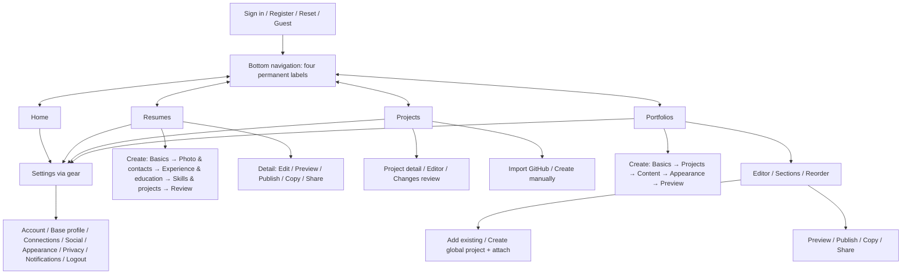
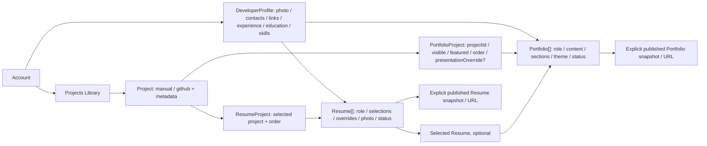

# StackCard Redesign Plan

**Figma-first переработка модели продукта, навигации и ключевых экранов**

---

## Содержание

- [Scope и аудит](#scope-и-аудит)
- [Экранная карта](#экранная-карта)
- [Navigation map](#navigation-map)
- [Целевая domain relation](#целевая-domain-relation)
- [Последовательность работы](#последовательность-работы)
- [Результат первой итерации](#результат-первой-итерации)
- [Приёмка](#приёмка)

---

## Scope и аудит

Прямое поручение 2026-10-04 меняет target UX/UI StackCard. Первый scope:
repository/Figma audit → IA → target design system → **Home, Resumes, Projects,
Portfolios, Settings** в Figma. Core flows, state set, web и implementation —
следующие шаги. Это не изменение готовности продуктовых Phase 0–20 и не начало
runtime Media/web. История/статус — в [product spec](../product/product-spec.md).

Visual contract — [design-system.md](design-system.md), provenance —
[design-contract.md](design-contract.md), future integration —
[implementation-handoff.md](implementation-handoff.md).

| Источник | Наблюдение и следствие |
| --- | --- |
| [Figma 3YhNUPDIJJWB39NSBxbRr6](https://www.figma.com/design/3YhNUPDIJJWB39NSBxbRr6/StackCard) | Исходный MCP-аудит: 9 pages, 31 COMPONENT/COMPONENT_SET узел, color/metrics collections; расширяем связанными instances |
| [AppShell](../../apps/mobile/lib/app/app_shell.dart), [router](../../apps/mobile/lib/app/app_router.dart) | Старые tabs/header/logout, скрытые labels/tablet sidebar; нужны четыре новых roots и contextual Back |
| [PortfolioContent](../../apps/mobile/lib/features/portfolio_draft/domain/portfolio_content.dart) | Singleton profile/projects/skills/experience/education/links/plain resume/blocks/theme; multiple outputs требуют будущей миграции |
| [Project](../../apps/mobile/lib/features/portfolio_draft/domain/portfolio_project.dart) | Source/metadata сохранять; global featured/visible переносить в association |
| [Shared UI](../../apps/mobile/lib/shared/widgets), [theme](../../apps/mobile/lib/core/theme) | Existing widgets/tokens — integration points; runtime пока красный |
| [Web](../../apps/web/README.md) | Только README; screens target, не готовое Next.js-приложение |

---

## Экранная карта

| Решение | Сейчас | Target и причина |
| --- | --- | --- |
| Keep | Auth/register/reset/guest | Сохранить session/guard flows и спокойную форму |
| Keep | GitHub import/search/pagination/cache/review | Explicit Add/Accept/Ignore, source/curated separation, retry |
| Keep | CRUD/preview/notes/sync feedback | Полезные функции сохраняются |
| Refactor | Home poster/completion/featured | Control center: quick access, recent outputs/projects, updates |
| Refactor | Projects как проекция Portfolio | Global library: Import/Create/Search/All-GitHub-Manual/source-usage-sync |
| Rename / move | Portfolio root как один showcase | Portfolios list; showcase → конкретный detail/preview |
| Refactor | Builder/section editors | Name/status/mini-preview, focused sections/reorder/appearance/publishing |
| Move / expand | Settings tab | Gear → Account/Profile/Connections/Social/Appearance/Privacy/Notifications/Session |
| Remove / replace | Global header/logout/completion/Featured/textarea Resume/tablet sidebar | Contextual titles/back, creation stepper, association featured, structured CV, единая IA |
| Create | Resumes | List/detail/create/selectors/photo/preview/publishing/share |
| Create | Portfolio creation/selectors | Add existing или global create + attach, content/Resume/theme/preview/publish |
| Create | Shared states | Skeleton/offline/error/empty/denied/copy/deletion/long content |
| Create | Web | Landing/Download/Auth/reset/Public Resume-Portfolio/Privacy-Terms-404 |

Original branding сохраняется архивом; lime geometry recolor создаётся в Figma.
Published outputs имеют постоянный Copy Link/Open/Share; Draft — Edit/Preview.

---

## Navigation map

Это **target**, не существующие route paths. Tab change не создаёт nested Back
history; Settings возвращает в originating root. Nested screens имеют compact
contextual Back и platform gesture.

| Root | Основные переходы |
| --- | --- |
| Home | Continue recent entity, quick access, GitHub changes, Settings |
| Resumes | Create; detail/edit/duplicate/delete/preview/publish/share; Settings |
| Projects | Import/manual create; detail/editor/source changes; Settings |
| Portfolios | Create; editor/selectors/appearance/preview/publish/share; Settings |

Implementation обновляет guard allowlist/named routes/deep links вместе.
Public GitHub username browsing не требует connection; connect — отдельный
future flow. Private editors требуют account/explicit guest; publication —
подходящего account/online состояния.

---

## Целевая domain relation

Это **target model**, не текущая Firestore/Hive schema. Base Profile и Project
не дублируются внутри outputs; selections/overrides относятся к Resume/Portfolio.

| Relation / операция | Правило |
| --- | --- |
| Profile → output | Предлагать base data; hide/override меняют output. Live inheritance/snapshot уточнить при storage contract, не обещать automatic republish |
| Project → outputs | Один Project используется в нескольких outputs; usage считается по associations |
| Create inside Portfolio | Global Project + attach, без portfolio-only сущности |
| Remove from Portfolio | Удалить связь, сохранить library Project |
| Delete library Project | Отдельная confirmation показывает usage и последствия |
| Featured / visible / order | Принадлежат PortfolioProject, не global Project |
| Metadata | ID/name/role/status/createdAt/updatedAt, public URL постоянно после publish |
| Public | Явный snapshot без notes/source overrides/hidden data; refresh/sync не публикуют |

Current singleton migration, output slugs и legacy resumeText определяются
до implementation. Existing notes/curated projects должны сохраниться.

---

## Последовательность работы

Design-шаги не заменяют roadmap Phase 0–20. Первый scope — 1–4; дальше
итерации после проверки цельности предыдущего flow.

| Шаг | Что должно быть сделано | Check |
| --- | --- | --- |
| 1. Audit | Figma/pages/components/variables + routes/models/shared UI/web | Evidence и Keep/Refactor/Remove/Create, target отделён от runtime |
| 2. IA | Четыре entities/global library/associations | Нет duplicated Project/plain textarea Resume; целостная navigation |
| 3. Figma DS | Semantic colors/metrics/type/components/navigation/states | Auto Layout, bindings/instances, labels/targets/contrast |
| 4. Key screens | Home/Resumes/Projects/Portfolios/Settings | Единая nav/Settings/back, разные cards, Copy/Draft semantics |
| 5. Core flows | Resume/photo/selectors, Project import/manual/review, Portfolio builder/reorder | Creation stepper, focused editors, attach/remove, Saved/Saving/publish/share |
| 6. States/responsive | Empty/loading/error/offline/denied/success/long content | 390/smaller/larger/landscape/upscaled/light-dark/keyboard/focus/contrast |
| 7. Web design | Landing/Download/Public Resume-Portfolio/Auth/legal/404 | Desktop/mobile, demos/CTA, metadata/print-friendly Resume |
| 8. Mobile implementation | Migration, shared tokens/components, screens/flows | Domain/DI/storage/UID сохранены, relevant tests/native acceptance |
| 9. Web implementation | Next.js, public/private contracts | Source-backed routes/metadata/OpenGraph/responsive/focus/validation |
| 10. Motion/QA | Intentional motion после стабильного layout, reduced motion | Нет blocking/heavy loops; states и размеры проверены |

Resume v1 объединяет experience+education и skills+projects: пять содержательных
creation шагов до publish. Portfolio отделяет projects от content/appearance/
preview. Photo/camera/gallery permissions и empty selectors рисуются до media API.
Openship — web polish benchmark; 21st.dev — адаптируемые patterns.

---

## Результат первой итерации

**2026-10-04:** audit, IA, target DS и пять key screens выполнены в существующем
Figma-файле. Старые compositions сохранены для сравнения; новый target размещён
отдельно справа на dark/light pages. Использованы Auto Layout, variables,
shared masters и связанные instances; UI остаётся редактируемым.

| Экран | Dark frame | Light frame |
| --- | --- | --- |
| Home | [38:3901](https://www.figma.com/design/3YhNUPDIJJWB39NSBxbRr6/StackCard?node-id=38-3901) | [44:474](https://www.figma.com/design/3YhNUPDIJJWB39NSBxbRr6/StackCard?node-id=44-474) |
| Resumes | [38:3902](https://www.figma.com/design/3YhNUPDIJJWB39NSBxbRr6/StackCard?node-id=38-3902) | [44:584](https://www.figma.com/design/3YhNUPDIJJWB39NSBxbRr6/StackCard?node-id=44-584) |
| Projects | [38:3903](https://www.figma.com/design/3YhNUPDIJJWB39NSBxbRr6/StackCard?node-id=38-3903) | [44:661](https://www.figma.com/design/3YhNUPDIJJWB39NSBxbRr6/StackCard?node-id=44-661) |
| Portfolios | [38:3904](https://www.figma.com/design/3YhNUPDIJJWB39NSBxbRr6/StackCard?node-id=38-3904) | [44:741](https://www.figma.com/design/3YhNUPDIJJWB39NSBxbRr6/StackCard?node-id=44-741) |
| Settings | [38:3905](https://www.figma.com/design/3YhNUPDIJJWB39NSBxbRr6/StackCard?node-id=38-3905) | [44:852](https://www.figma.com/design/3YhNUPDIJJWB39NSBxbRr6/StackCard?node-id=44-852) |

Editable boards: [IA/model](https://www.figma.com/design/3YhNUPDIJJWB39NSBxbRr6/StackCard?node-id=47-3002),
[Foundations rules](https://www.figma.com/design/3YhNUPDIJJWB39NSBxbRr6/StackCard?node-id=47-7),
[Components specimen](https://www.figma.com/design/3YhNUPDIJJWB39NSBxbRr6/StackCard?node-id=43-1069).

**Проверено через MCP и renders:**

- 86 local variables: 39 Primitives, 25 Color, 22 Metrics; Color имеет Dark/Light.
  Scopes и WEB code syntax проверены; HEX-подписи Foundations синхронизированы.
- 37 text styles; DM Sans, Noto Sans и IBM Plex Mono доступны. Card titles и
  metadata используют shared styles; кириллица и tab labels читаемы.
- На components page 63 COMPONENT/COMPONENT_SET узла после refactor:
  добавлены 18 UI components и 14 icons. Existing Button/Input/Brand/Navigation
  адаптированы; logo geometry сохранена с lime recolor.
- Новые patterns: SettingsButton, IconButton, CarouselItem, CopyLinkButton,
  ShareButton, StatusLabel, SettingsRow, SectionHeader, ResumeCard, PortfolioCard,
  ProjectCard, FilterChip, Stepper, EmptyState, ErrorState, LoadingSkeleton,
  Toast, BottomSheet. Это первый набор, не полная state matrix.
- Все десять 390×844 renders и component specimen просмотрены. Root labels
  постоянны; Settings имеет contextual Back и Logout; Draft отделён от Published.
- По 19 prototype transitions в каждой теме: 12 tab switches, 4 Settings,
  2 Home quick links и 1 Back. Destination IDs проверены внутри своей темы.
  Creation/Edit/Copy/Share пока показаны как controls, их полные flows ещё открыты.
- Primary actions, settings/back, copy/share и filter chips имеют targets
  не менее 48 px; nav hit areas — 87.5×50 px. Это не заменяет полную accessibility QA.
- Расчёт контраста: ink/lime 17.02:1; secondary/background 8.47:1 dark и
  7.09:1 light; muted/background 4.55:1 и 4.83:1; sourceText/background
  13.80:1 и 6.20:1. Keyboard/focus/screen-reader и соседние surfaces проверяются отдельно.

**Следующий design scope:** Resume creation/photo/selectors/detail; Project
manual/import/review; Portfolio creation/editor/section order/appearance;
publication/access/share и confirmation flows. Затем полная state matrix,
responsive и web. Примеры контента и URL в макетах — mock, не действующие outputs.

## Приёмка

- [x] Прочитаны новые требования и project sources.
- [x] Выполнен repository audit routes/models/shared UI и фактического web.
- [x] MCP-аудит Figma: 9 pages, components и color/metrics collections.
- [x] Зафиксированы экранная карта, navigation и domain relation.
- [x] Обновлён canonical target design guide, отделён current runtime.
- [x] Новые Figma variables/components проверены по IDs/bindings.
- [x] Созданы и визуально проверены пять key screens в dark и light, 390×844.
- [x] Prototype links подтверждают key navigation: по 19 transitions в обеих темах.
- [ ] Core flows и полный набор состояний выполнены.
- [ ] Responsive, large text, keyboard/focus, screen-reader и reduced motion QA выполнены.
- [ ] Web target screens выполнены и проверены.
- [ ] Flutter/web и schema migration выполнены.

Full-data макеты не закрывают states/runtime; Flutter tests в этой Figma и
documentation итерации не запускались.

Проверка восьми затронутых Markdown-документов через `check_docs.py` прошла:
ошибок оформления и локальных ссылок нет. `git diff --check` прошёл.
